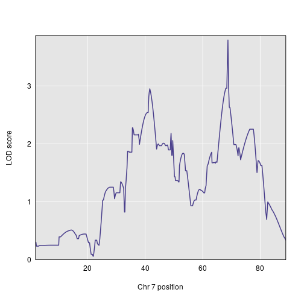
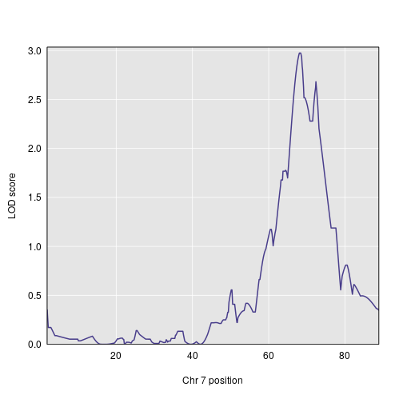

First, we read in the saved data files. These contain the genome map, genotype probabilities, and trait values.

~~~
library(magrittr)
map <- readRDS("../data/derived_data/map.rds")
probs <- readRDS("../data/derived_data/probs.rds")
pheno <- readRDS("../data/derived_data/pheno.rds")
~~~
{: .r}

We tweak the rownames so that subjects' phenotype values can be matched with their genotypes. We also create a set of vectors to indicate batch number.

~~~
rownames(pheno) <- rownames(probs$`1`)
batch <- tibble::tibble(batch1 = pheno$batch == 1, batch2 = pheno$batch == 2, batch3 = pheno$batch == 3) %>%
  purrr::map_df(.f = as.numeric) %>%
  as.matrix %>%
  (function(x) {rownames(x) <- rownames(probs$`1`); return(x)})
~~~
{: .r}

We want to incorporate polygenic effects into our models, so we calculate a relatedness matrix. 

~~~
kinship <- qtl2::calc_kinship(probs)
~~~
{: .r}

Now, we can perform the QTL scans.

~~~
aprobs <- qtl2::genoprob_to_alleleprob(probs)
s1out_ap <- qtl2::scan1(genoprobs = aprobs, pheno = pheno[ , 1:3], kinship = kinship, addcovar = cbind(batch, pheno$sex), reml = TRUE, cores = 0)
~~~
{: .r}

~~~
qtl2::find_peaks(s1out_ap, map)
~~~
{: .r}

~~~
  lodindex lodcolumn chr   pos      lod
1        2 SpleenCFU   7 68.79 3.792543
~~~
{: .output}

~~~
qtl2::plot_scan1(s1out_ap[, 2, drop = FALSE], map = map, chr = 7)
~~~
{: .r}

~~~
qtl2::plot_scan1(s1out_ap[, 3, drop = FALSE], map = map, chr = 7)
~~~
{: .r}

