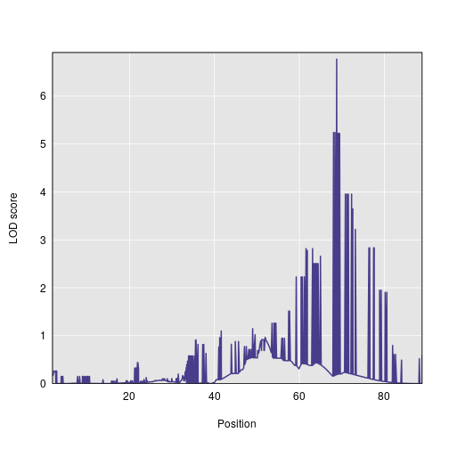
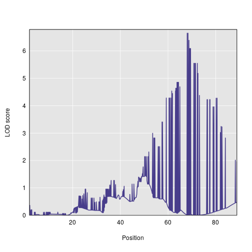
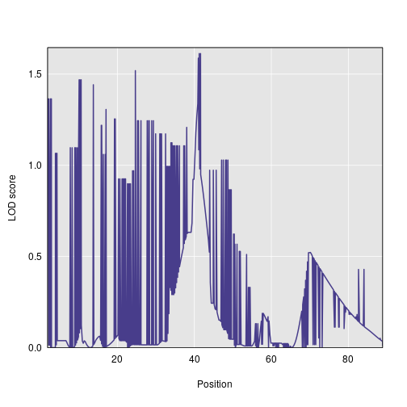
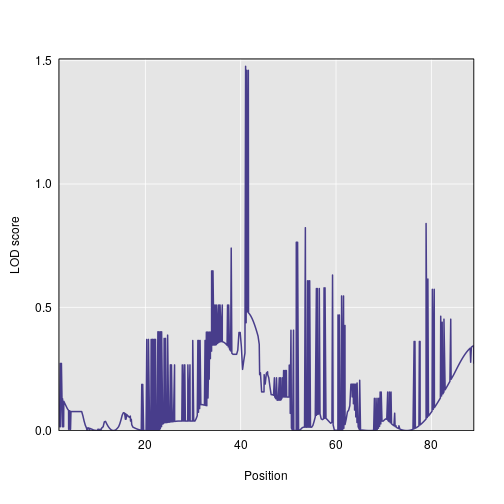
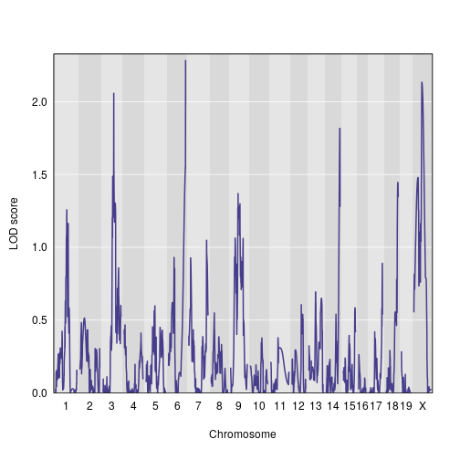

First, we read in the saved data files. These contain the genome map, genotype probabilities, and trait values.

~~~
library(magrittr)
map <- readRDS("../data/derived_data/map.rds")
probs <- readRDS("../data/derived_data/probs.rds")
pheno <- readRDS("../data/derived_data/pheno.rds")
~~~
{: .r}

We tweak the rownames so that subjects' phenotype values can be matched with their genotypes. We also create a set of vectors to indicate batch number.

~~~
rownames(pheno) <- rownames(probs$`1`)
batch <- tibble::tibble(batch1 = pheno$batch == 1, batch2 = pheno$batch == 2, batch3 = pheno$batch == 3) %>%
  purrr::map_df(.f = as.numeric) %>%
  as.matrix %>%
  (function(x) {rownames(x) <- rownames(probs$`1`); return(x)})
~~~
{: .r}

We want to incorporate polygenic effects into our models, so we calculate a relatedness matrix. 

~~~
kinship <- qtl2::calc_kinship(probs)
~~~
{: .r}

Now, we can perform the QTL scans.

~~~
aprobs <- qtl2::genoprob_to_alleleprob(probs)
s1out_ap <- qtl2::scan1(genoprobs = aprobs, pheno = pheno[ , 1:3], kinship = kinship, addcovar = cbind(batch, pheno$sex), reml = TRUE, cores = 0)
~~~
{: .r}

## Function to convert genotype probabilities to binary

Our goal is to recode the genotypes according to dominance models and then do univariate QTL scans with those recoded genotypes.

So, we'll do a single QTL scan for each of the two encodings:

1. AA -> 0; AB -> 1; BB -> 1 (B dominant)

2. AA -> 1; AB -> 1; BB -> 0 (A dominant)

So, inputs to `qtl2::scan1` will be a genoprobs object that is a list of arrays, each n by 1 by n.markers. The one column for each array is the probability of having the dominant allele.

~~~
length(probs)
~~~
{: .r}

~~~
[1] 20
~~~
{: .output}

~~~
colnames(probs$`1`)
~~~
{: .r}

~~~
[1] "AA" "AB" "BB"
~~~
{: .output}

~~~
# A dominant
probs$`1` -> pp
sum_columns <- function(x, dominant_allele = "A"){
  if (dominant_allele == "A") {da_numeric <- 1} else {da_numeric <- 3}
  out <- x[, da_numeric, ] + x[, 2, ]
  return(out)
}
#sum_columns(pp) %>% array(dim = c(nrow(.), 1, ncol(.)))

probs_A_dominant <- probs %>%
  purrr::map(.f = function(x){
    sum_columns(x) -> ss
  }) %>%
  purrr::map(.f = function(x){array(data = x, dim = c(nrow(x), 1, ncol(x)))}) %>%
  purrr::map(.f = function(x){abind::abind(x, 1-x, along = 2)}) %>%
  purrr::map2(.y = probs, .f = function(x, y) {dimnames(x)[[1]] <- dimnames(y)[[1]]; dimnames(x)[[2]] <- c("dominant_allele", "recessive_allele"); dimnames(x)[[3]] <- dimnames(y)[[3]]; return(x)}) %>%
  (function(x){attributes(x) <- attributes(probs); return(x)})
probs_B_dominant <- probs %>%
  purrr::map(.f = sum_columns, dominant_allele = "B") %>%
  purrr::map(.f = function(x){array(data = x, dim = c(nrow(x), 1, ncol(x)))}) %>%
  purrr::map(.f = function(x){abind::abind(x, 1-x, along = 2)}) %>%
  purrr::map2(.y = probs, .f = function(x, y) {dimnames(x)[[1]] <- dimnames(y)[[1]]; dimnames(x)[[2]] <- c("dominant_allele", "recessive_allele"); dimnames(x)[[3]] <- dimnames(y)[[3]]; return(x)}) %>%
  (function(x){attributes(x) <- attributes(probs); return(x)})
~~~
{: .r}

~~~
A_dom<- qtl2::scan1(genoprobs = probs_A_dominant, pheno = pheno[, 1:3], addcovar = cbind(batch, pheno$sex), kinship = kinship, reml = TRUE, cores = 0)
~~~
{: .r}

~~~
B_dom<- qtl2::scan1(genoprobs = probs_B_dominant, pheno = pheno[, 1:3], addcovar = cbind(batch, pheno$sex), kinship = kinship, reml = TRUE, cores = 0)
~~~
{: .r}

~~~
qtl2::find_peaks(A_dom, map, threshold = 2)
~~~
{: .r}

~~~
  lodindex lodcolumn chr    pos      lod
1        1   LungCFU  14 65.779 2.246528
2        1   LungCFU   X 20.011 2.129416
3        2 SpleenCFU   7 68.790 6.773208
4        3      IFNg   7 67.893 6.661577
5        3      IFNg   9  2.476 2.160932
6        3      IFNg  15 38.849 2.137946
~~~
{: .output}

~~~
qtl2::find_peaks(B_dom, map, threshold = 2)
~~~
{: .r}

~~~
  lodindex lodcolumn chr    pos      lod
1        1   LungCFU   X 38.355 2.132873
2        2 SpleenCFU   8 25.667 2.035441
3        3      IFNg  10 62.215 2.120904
~~~
{: .output}

~~~
qtl2::plot_scan1(A_dom[, 2, drop = FALSE], map$`7`)
~~~
{: .r}

~~~
qtl2::plot_scan1(A_dom[, 3, drop = FALSE], map$`7`)
~~~
{: .r}

~~~
qtl2::plot_scan1(B_dom[, 2, drop = FALSE], map$`7`)
~~~
{: .r}

~~~
qtl2::plot_scan1(B_dom[, 3, drop = FALSE], map$`7`)
~~~
{: .r}

## Next step: get permutation pvalues with 1000 perms.

~~~
A_dom_perms<- qtl2::scan1perm(genoprobs = probs_A_dominant, pheno = pheno[, 1:3], addcovar = cbind(batch, pheno$sex), kinship = kinship, reml = TRUE, cores = 0, n_perm = 1000)
saveRDS(A_dom_perms, "../data/derived_data/perms_A_dominance_F2.rds")
~~~
{: .r}

~~~
B_dom_perms <- qtl2::scan1perm(genoprobs = probs_B_dominant, pheno = pheno[, 1:3], addcovar = cbind(batch, pheno$sex), kinship = kinship, reml = TRUE, cores = 0, n_perm = 1000)
saveRDS(B_dom_perms, "../data/derived_data/perms_B_dominance_F2.rds")
~~~
{: .r}

~~~
A_dom_perms <- readRDS("../data/derived_data/perms_A_dominance_F2.rds")
B_dom_perms <- readRDS("../data/derived_data/perms_B_dominance_F2.rds")
~~~
{: .r}

~~~
get_pvalue <- function(observed_lod, perm_lods){
  mean(perm_lods >= observed_lod)
}

qtl2::find_peaks(A_dom, map) %>%
  dplyr::mutate(pvalue = purrr::map2_dbl(.x = lod, .y = lodindex, .f = function(x, y) get_pvalue(x, A_dom_perms[ , y])))
~~~
{: .r}

~~~
  lodindex lodcolumn chr    pos      lod pvalue
1        2 SpleenCFU   7 68.790 6.773208      0
2        3      IFNg   7 67.893 6.661577      0
~~~
{: .output}

~~~
# get quantiles of perms
quantile(A_dom_perms[, 1], c(0.95, 0.9))
~~~
{: .r}

~~~
     95%      90% 
3.163204 2.792136 
~~~
{: .output}

~~~
quantile(A_dom_perms[, 2], c(0.95, 0.9))
~~~
{: .r}

~~~
     95%      90% 
3.003136 2.764453 
~~~
{: .output}

~~~
quantile(A_dom_perms[, 3], c(0.95, 0.9))
~~~
{: .r}

~~~
     95%      90% 
3.029142 2.779337 
~~~
{: .output}

~~~
quantile(B_dom_perms[, 1], c(0.95, 0.9))
~~~
{: .r}

~~~
     95%      90% 
3.071265 2.770366 
~~~
{: .output}

~~~
quantile(B_dom_perms[, 2], c(0.95, 0.9))
~~~
{: .r}

~~~
     95%      90% 
3.089465 2.793354 
~~~
{: .output}

~~~
quantile(B_dom_perms[, 3], c(0.95, 0.9))
~~~
{: .r}

~~~
     95%      90% 
3.235467 2.865512 
~~~
{: .output}

## Analysis for hets v. non-hets

~~~
pr_hets <- probs %>%
  purrr::map(.f = function(x){
    x[, 1 , ] <- x[ , 3, ] + x[ , 1, ]
    return(x[ , 1:2, ])
  }) %>%
  (function(x){attributes(x) <- attributes(probs); return(x)})
s1out_het <- qtl2::scan1(genoprobs = pr_hets, 
                         pheno = pheno[, 1:3], 
                         addcovar = cbind(batch, pheno$sex), 
                         kinship = kinship, 
                         reml = TRUE, 
                         cores = 1
                         )
qtl2::plot_scan1(s1out_het, map = map)
~~~
{: .r}

~~~
het_perms <- qtl2::scan1perm(genoprobs = pr_hets, 
                             pheno = pheno[, 1:3], 
                             addcovar = cbind(batch, pheno$sex), 
                             kinship = kinship, 
                             reml = TRUE, 
                             cores = parallel::detectCores() - 1, 
                             n_perm = 1000
                             )
saveRDS(het_perms, "../data/derived_data/het_perms.rds")
~~~
{: .r}

~~~
het_perms <- readRDS("../data/derived_data/het_perms.rds")
summary(het_perms)
~~~
{: .r}

~~~
LOD thresholds (1000 permutations)
     LungCFU SpleenCFU IFNg
0.05    3.24      3.31 3.31
~~~
{: .output}

~~~
s1out_het %>%
  qtl2::find_peaks(map = map) %>%
  dplyr::mutate(pvalue = purrr::map2_dbl(.x = lod, .y = lodindex, .f = function(x, y) get_pvalue(x, het_perms[ , y])))
~~~
{: .r}

~~~
  lodindex lodcolumn chr    pos      lod pvalue
1        2 SpleenCFU   7 68.790 3.161447  0.071
2        3      IFNg   7 78.895 4.033734  0.005
~~~
{: .output}

