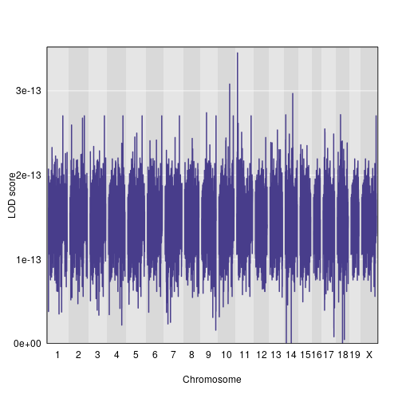
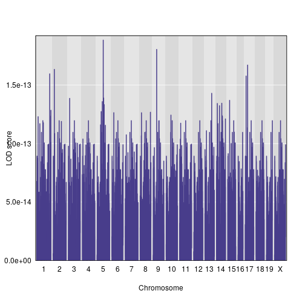
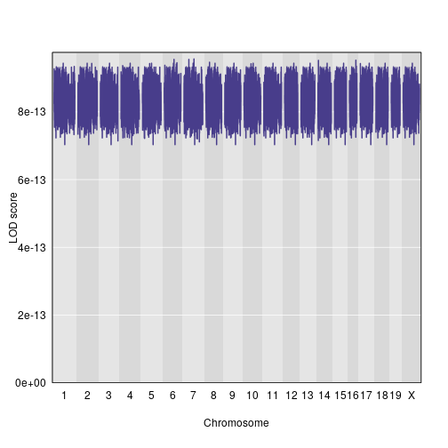

First, we read in the saved data files. These contain the genome map, genotype probabilities, and trait values.

~~~
library(magrittr)
map <- readRDS("../data/derived_data/map.rds")
probs <- readRDS("../data/derived_data/probs.rds")
pheno <- readRDS("../data/derived_data/pheno.rds")
~~~
{: .r}

We tweak the rownames so that subjects' phenotype values can be matched with their genotypes. We also create a set of vectors to indicate batch number.

~~~
rownames(pheno) <- rownames(probs$`1`)
batch <- tibble::tibble(batch1 = pheno$batch == 1, batch2 = pheno$batch == 2, batch3 = pheno$batch == 3) %>%
  purrr::map_df(.f = as.numeric) %>%
  as.matrix %>%
  (function(x) {rownames(x) <- rownames(probs$`1`); return(x)})
~~~
{: .r}

We want to incorporate polygenic effects into our models, so we calculate a relatedness matrix. 

~~~
kinship <- qtl2::calc_kinship(probs)
~~~
{: .r}

Now, we can perform the QTL scans.

~~~
out <- list()
for (j in 1:18){
  pr <- probs[[j]]
  f1out <- list()
  for (i in 1:dim(pr)[[3]]){
    f1out[[i]] <- qtl2::fit1(genoprobs = pr[ , , i], 
                         pheno = pheno[ , 1, drop = FALSE], #lung cfu trait
                         kinship = kinship, 
                         addcovar = cbind(batch, pheno$sex), 
                         contrasts = cbind(mu=c(1, 1, 1), 
                                           a=c(-1, 0, 1), 
                                           d=c(0, 1, 0)), 
                         reml = TRUE, 
                         cores = 0
                         )

  }
  out[[j]] <- f1out
}
saveRDS(out, "../data/out-fit1.rds")
~~~
{: .r}

~~~
s1out <- qtl2::scan1(genoprobs = probs, 
                     pheno = pheno[, 1:3], 
                     kinship = kinship, 
                     addcovar = cbind(batch, pheno$sex), 
                     cores = 0
                     )
qtl2::find_peaks(s1out, map = map, threshold = 2)
~~~
{: .r}

~~~
   lodindex lodcolumn chr    pos      lod
1         1   LungCFU   3 49.523 2.060117
2         1   LungCFU   6 78.325 2.353980
3         1   LungCFU   7 35.675 2.025513
4         1   LungCFU  14 65.779 2.378495
5         1   LungCFU   X 38.355 2.177884
6         2 SpleenCFU   7 68.790 6.849362
7         2 SpleenCFU   8 25.667 2.210979
8         3      IFNg   7 67.893 6.663188
9         3      IFNg   9  2.476 2.207654
10        3      IFNg  10 62.215 2.155271
11        3      IFNg  15 38.599 2.997543
~~~
{: .output}

~~~
aprobs <- qtl2::genoprob_to_alleleprob(probs)
s1outa <- qtl2::scan1(genoprobs = aprobs, 
                     pheno = pheno[, 1:3], 
                     kinship = kinship, 
                     addcovar = cbind(batch, pheno$sex), 
                     cores = 0
                     )
qtl2::find_peaks(s1outa, map = map, threshold = 2)
~~~
{: .r}

~~~
  lodindex lodcolumn chr    pos      lod
1        1   LungCFU   7 35.675 2.025201
2        2 SpleenCFU   7 68.790 3.792543
3        3      IFNg   7 68.401 2.974409
4        3      IFNg  15 38.849 2.729513
~~~
{: .output}

## Dominance effects for lung CFU

We'll extract lods from the object `out`, then look at the differences between these LODs and the LODs of the `scan1` output, `scan1out`.

~~~
lod_a_plus_d <- out %>%
  purrr::map(.f = function(x)purrr::map_dbl(.x = x, .f = function(x)x$lod)) %>%
  unlist()
~~~
{: .r}

~~~
domlod <- s1out %>%
  tibble::as_tibble() %>%
  dplyr::mutate(markernum = 1:7467) %>%
  dplyr::filter(markernum <= 6880) %>%
  dplyr::mutate(lungCFU_a_plus_d = lod_a_plus_d, 
                lod_dominance = lungCFU_a_plus_d - LungCFU) %>%
  dplyr::select(lod_dominance) %>%
  as.matrix() %>%
  (function(x){rownames(x)<- rownames(s1out)[1:6880]; return(x)}) 

qtl2::plot_scan1(domlod, map)
~~~
{: .r}

~~~
qtl2::find_peaks(domlod, map, threshold = 1, peakdrop = 1, drop = 0.5)
~~~
{: .r}

~~~
[1] lodindex  lodcolumn chr       pos       lod       ci_lo     ci_hi    
<0 rows> (or 0-length row.names)
~~~
{: .output}

## Dominance effects for spleen CFU

~~~
sp_out <- list()
for (j in 1:18){
  pr <- probs[[j]]
  f1out <- list()
  for (i in 1:dim(pr)[[3]]){
    f1out[[i]] <- qtl2::fit1(genoprobs = pr[ , , i], 
                         pheno = pheno[ , 1, drop = FALSE], #lung cfu trait
                         kinship = kinship, 
                         addcovar = cbind(batch, pheno$sex), 
                         contrasts = cbind(mu=c(1, 1, 1), 
                                           a=c(-1, 0, 1), 
                                           d=c(0, 1, 0)), 
                         reml = TRUE, 
                         cores = 0
                         )

  }
  sp_out[[j]] <- f1out
}
saveRDS(sp_out, "../data/out-fit1-spleenCFU.rds")
~~~
{: .r}

~~~
lod_a_plus_d <- sp_out %>%
  purrr::map(.f = function(x)purrr::map_dbl(.x = x, .f = function(x)x$lod)) %>%
  unlist()
~~~
{: .r}

~~~
domlod <- s1out %>%
  tibble::as_tibble() %>%
  dplyr::mutate(markernum = 1:7467) %>%
  dplyr::filter(markernum <= 6880) %>%
  dplyr::mutate(spleenCFU_a_plus_d = lod_a_plus_d, 
                lod_dominance = spleenCFU_a_plus_d - SpleenCFU) %>%
  dplyr::select(lod_dominance) %>%
  as.matrix() %>%
  (function(x){rownames(x)<- rownames(s1out)[1:6880]; return(x)})
qtl2::plot_scan1(domlod, map)                   
~~~
{: .r}

~~~
qtl2::find_peaks(domlod, map, threshold = 1, peakdrop = 1, drop = 0.5)
~~~
{: .r}

~~~
   lodindex     lodcolumn chr    pos      lod  ci_lo  ci_hi
1         1 lod_dominance   1 31.675 1.095478  4.651 59.871
2         1 lod_dominance   2 44.973 1.182718 18.628 49.628
3         1 lod_dominance   2 49.828 1.153147 49.628 49.878
4         1 lod_dominance   2 49.935 1.153135 49.878 66.128
5         1 lod_dominance   3 19.769 1.055856  3.769 19.904
6         1 lod_dominance   3 20.019 1.031514 19.904 20.216
7         1 lod_dominance   3 20.269 1.005341 20.216 25.909
8         1 lod_dominance   3 30.769 1.089834 25.909 30.786
9         1 lod_dominance   3 31.019 1.076843 30.786 32.528
10        1 lod_dominance   3 44.708 1.179865 42.769 46.769
11        1 lod_dominance   3 49.686 1.393469 47.519 50.269
12        1 lod_dominance   4 21.318 1.055856  2.818 22.893
13        1 lod_dominance   4 32.318 1.089834 23.001 32.566
14        1 lod_dominance   4 32.568 1.076843 32.566 60.568
15        1 lod_dominance   5 21.139 1.055856  5.210 21.216
16        1 lod_dominance   5 21.389 1.031514 21.216 26.489
17        1 lod_dominance   5 32.139 1.089834 26.489 60.389
18        1 lod_dominance   6 29.331 1.170123 17.066 78.543
19        1 lod_dominance   7 20.643 1.055856  4.643 20.653
20        1 lod_dominance   7 20.893 1.031514 20.653 21.880
21        1 lod_dominance   7 31.393 1.026388 21.880 31.478
22        1 lod_dominance   7 31.643 1.089834 31.478 59.893
23        1 lod_dominance   8 20.917 1.055856  5.123 20.938
24        1 lod_dominance   8 21.167 1.031514 20.938 25.912
25        1 lod_dominance   8 31.917 1.089834 25.912 31.979
26        1 lod_dominance   8 32.167 1.076843 31.979 60.167
27        1 lod_dominance   9 19.177 1.055856  3.177 20.688
28        1 lod_dominance   9 30.177 1.089834 20.843 36.677
29        1 lod_dominance   9 38.413 1.074173 38.177 38.427
30        1 lod_dominance   9 39.354 1.118033 39.177 39.427
31        1 lod_dominance   9 39.782 1.118043 39.677 39.927
32        1 lod_dominance   9 40.067 1.113625 39.927 40.177
33        1 lod_dominance   9 40.344 1.113655 40.177 40.427
34        1 lod_dominance   9 42.319 1.432398 42.177 42.427
35        1 lod_dominance   9 42.593 1.464558 42.427 42.677
36        1 lod_dominance   9 43.573 1.331873 43.427 43.677
37        1 lod_dominance   9 43.726 1.297357 43.677 43.927
38        1 lod_dominance   9 45.513 1.444376 43.927 45.677
39        1 lod_dominance   9 45.974 1.444452 45.927 46.177
40        1 lod_dominance   9 46.314 1.298543 46.177 46.427
41        1 lod_dominance   9 56.568 1.190637 46.427 56.927
42        1 lod_dominance   9 72.627 1.053768 71.177 72.677
43        1 lod_dominance   9 73.441 1.004418 72.927 73.677
44        1 lod_dominance   9 75.067 1.012835 73.927 75.067
45        1 lod_dominance  10 18.463 1.055856  2.577 24.524
46        1 lod_dominance  10 29.701 1.431917 28.884 30.463
47        1 lod_dominance  11 21.825 1.055856  5.825 29.704
48        1 lod_dominance  11 32.575 1.026388 29.704 32.629
49        1 lod_dominance  11 32.825 1.089834 32.823 61.075
50        1 lod_dominance  12 20.777 1.055856  4.777 30.854
51        1 lod_dominance  12 31.777 1.089834 30.985 63.265
52        1 lod_dominance  13 32.527 1.089834  3.553 62.027
53        1 lod_dominance  14 23.263 1.055856  7.263 24.410
54        1 lod_dominance  14 34.263 1.089834 24.410 49.013
55        1 lod_dominance  14 65.121 2.218551 65.013 65.263
56        1 lod_dominance  14 65.478 2.218591 65.263 65.513
57        1 lod_dominance  14 65.779 2.218593 65.763 66.013
58        1 lod_dominance  14 66.166 2.222496 66.013 66.263
59        1 lod_dominance  14 66.389 1.688490 66.263 66.389
60        1 lod_dominance  15 31.599 1.089834  4.599 53.599
61        1 lod_dominance  16 21.040 1.055856  5.040 27.919
62        1 lod_dominance  16 32.040 1.089834 27.919 34.040
63        1 lod_dominance  17 20.730 1.055856  4.856 22.699
64        1 lod_dominance  17 31.730 1.089834 22.699 59.980
65        1 lod_dominance  18 21.491 1.055856  5.491 26.438
66        1 lod_dominance  18 32.241 1.026388 26.438 32.325
67        1 lod_dominance  18 32.491 1.089834 32.325 34.386
68        1 lod_dominance  18 56.416 1.426904 54.241 56.491
69        1 lod_dominance  18 57.330 1.426937 57.241 57.491
70        1 lod_dominance  18 58.215 1.311195 57.991 58.241
71        1 lod_dominance  18 58.458 1.327576 58.241 58.491
72        1 lod_dominance  18 58.748 1.327585 58.741 58.991
73        1 lod_dominance  18 59.050 1.327585 58.991 59.050
74        1 lod_dominance  19 33.125 1.089834  6.125 35.125
75        1 lod_dominance   X 32.261 1.089834  5.261 60.511
~~~
{: .output}

## Dominance effects for IFNgamma

~~~
ifn_out <- list()
for (j in 1:18){
  pr <- probs[[j]]
  f1out <- list()
  for (i in 1:dim(pr)[[3]]){
    f1out[[i]] <- qtl2::fit1(genoprobs = pr[ , , i], 
                         pheno = pheno[ , 1, drop = FALSE], #lung cfu trait
                         kinship = kinship, 
                         addcovar = cbind(batch, pheno$sex), 
                         contrasts = cbind(mu=c(1, 1, 1), 
                                           a=c(-1, 0, 1), 
                                           d=c(0, 1, 0)), 
                         reml = TRUE, 
                         cores = 0
                         )

  }
  ifn_out[[j]] <- f1out
}
saveRDS(ifn_out, "../data/out-fit1-ifn.rds")
~~~
{: .r}

~~~
lod_a_plus_d <- ifn_out %>%
  purrr::map(.f = function(x)purrr::map_dbl(.x = x, .f = function(x)x$lod)) %>%
  unlist()
~~~
{: .r}

~~~
domlod <- s1out %>%
  tibble::as_tibble() %>%
  dplyr::mutate(markernum = 1:7467) %>%
  dplyr::filter(markernum <= 6880) %>%
  dplyr::mutate(ifng_a_plus_d = lod_a_plus_d, 
                lod_dominance = ifng_a_plus_d - IFNg) %>%
  dplyr::select(lod_dominance) %>%
  as.matrix() %>%
  (function(x){rownames(x)<- rownames(s1out)[1:6880]; return(x)})
qtl2::plot_scan1(domlod, map)                   
~~~
{: .r}

~~~
qtl2::find_peaks(domlod, map, threshold = 1, peakdrop = 1, drop = 0.5)
~~~
{: .r}

~~~
   lodindex     lodcolumn chr    pos      lod  ci_lo  ci_hi
1         1 lod_dominance   2 44.973 1.411410 44.128 45.878
2         1 lod_dominance   2 46.964 1.545529 46.878 47.128
3         1 lod_dominance   2 47.987 1.545523 47.878 48.128
4         1 lod_dominance   2 48.872 1.545515 48.628 48.878
5         1 lod_dominance   2 49.092 1.545523 48.878 49.128
6         1 lod_dominance   2 49.385 1.545560 49.378 49.628
7         1 lod_dominance   2 49.658 1.563440 49.628 49.878
8         1 lod_dominance   2 49.935 1.563417 49.878 50.128
9         1 lod_dominance   3 49.131 1.341617 30.269 49.269
10        1 lod_dominance   3 49.686 1.682863 49.519 49.769
11        1 lod_dominance   3 49.992 1.577281 49.769 50.019
12        1 lod_dominance   3 50.207 1.577138 50.019 50.269
13        1 lod_dominance   3 53.045 1.199836 52.769 53.269
14        1 lod_dominance   3 57.877 1.259974 57.769 58.019
15        1 lod_dominance   6 29.331 1.331626 21.316 33.316
16        1 lod_dominance   6 77.658 1.138555 57.066 77.816
17        1 lod_dominance   6 77.931 1.145293 77.816 78.066
18        1 lod_dominance   6 78.325 1.936512 78.316 78.543
19        1 lod_dominance   9 36.479 1.072636 15.278 36.677
20        1 lod_dominance   9 38.413 1.251428 38.177 38.427
21        1 lod_dominance   9 39.354 1.307228 39.177 39.427
22        1 lod_dominance   9 39.782 1.307235 39.677 39.927
23        1 lod_dominance   9 40.067 1.244027 39.927 40.177
24        1 lod_dominance   9 40.344 1.244012 40.177 40.427
25        1 lod_dominance   9 42.319 1.574368 42.177 42.427
26        1 lod_dominance   9 42.593 1.508829 42.427 42.677
27        1 lod_dominance   9 43.573 1.399031 43.427 43.677
28        1 lod_dominance   9 43.726 1.363492 43.677 43.927
29        1 lod_dominance   9 44.043 1.326516 43.927 44.177
30        1 lod_dominance   9 44.466 1.228878 44.427 44.677
31        1 lod_dominance   9 44.751 1.228848 44.677 44.927
32        1 lod_dominance   9 45.252 1.229121 45.177 45.427
33        1 lod_dominance   9 45.513 1.468078 45.427 45.677
34        1 lod_dominance   9 45.974 1.468160 45.927 46.177
35        1 lod_dominance   9 46.314 1.324702 46.177 46.427
36        1 lod_dominance   9 46.517 1.081346 46.427 46.677
37        1 lod_dominance   9 46.924 1.073094 46.677 46.927
38        1 lod_dominance   9 47.164 1.073060 46.927 47.177
39        1 lod_dominance   9 47.383 1.094334 47.177 47.427
40        1 lod_dominance   9 47.516 1.094330 47.427 47.677
41        1 lod_dominance   9 47.902 1.002305 47.677 47.927
42        1 lod_dominance   9 48.229 1.030874 48.177 48.427
43        1 lod_dominance   9 48.882 1.095625 48.677 75.067
44        1 lod_dominance  10 29.701 1.892918 28.713 29.713
45        1 lod_dominance  14 65.121 1.417659 34.013 65.263
46        1 lod_dominance  14 65.478 1.417675 65.263 65.513
47        1 lod_dominance  14 65.779 1.417684 65.763 66.013
48        1 lod_dominance  14 66.166 1.313950 66.013 66.389
49        1 lod_dominance  18 56.416 1.444987 32.491 56.491
50        1 lod_dominance  18 57.330 1.445011 57.241 57.491
51        1 lod_dominance  18 58.215 1.347520 57.991 58.241
52        1 lod_dominance  18 58.458 1.364331 58.241 58.491
53        1 lod_dominance  18 58.748 1.364341 58.741 58.991
54        1 lod_dominance  18 59.050 1.364341 58.991 59.050
~~~
{: .output}

